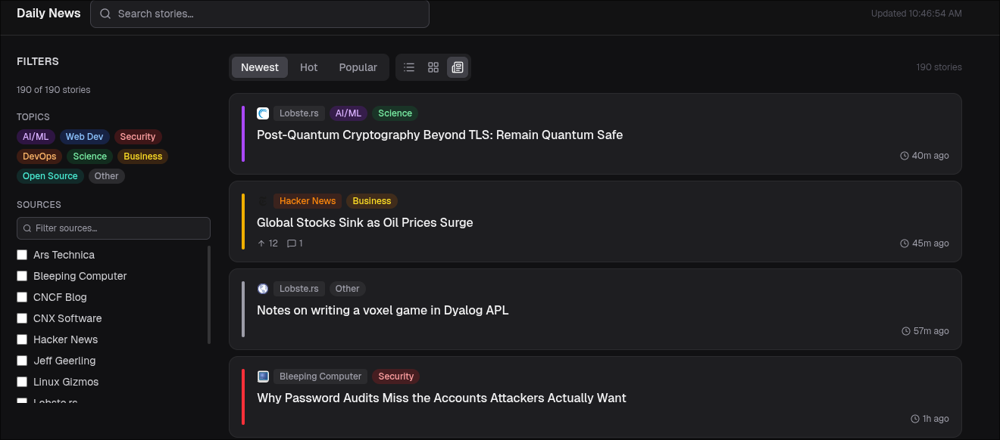

# Daily News

Personal news aggregator running at [news.alucard.dev](https://news.alucard.dev). Pulls from Hacker News and RSS feeds, categorizes stories with keyword rules and a Claude Haiku fallback, and presents them in a filterable card UI.



## Setup

```bash
npm install
cp .env.local.example .env.local  # add your ANTHROPIC_API_KEY
npm run dev
```

## Adding Sources

Edit `config/sources.ts`. Each entry is one of three types:

```ts
// Hacker News
{ id: "hn-top", type: "hackernews", displayName: "Hacker News", enabled: true, endpoint: "topstories", limit: 30 }

// RSS feed
{ id: "ars-technica", type: "rss", displayName: "Ars Technica", enabled: true, url: "https://feeds.arstechnica.com/arstechnica/index", limit: 20 }
```

Disable a source without removing it by setting `enabled: false`.

## How Fetching Works

Every page load serves a cached response. The cache refreshes every 15 minutes (Next.js ISR).

**Hacker News** — fetches the top N IDs from HN's ranked `topstories` list, then fetches each item individually. You always get whatever HN currently considers the top stories.

**RSS** — takes the first N items from the feed as-is, newest first. No ranking.

After fetching, all results are:
1. Deduplicated by URL
2. Categorized (keyword rules → Claude Haiku batch fallback for anything unmatched)
3. Sorted newest-first by default (Hot and Popular sort modes available in the UI)

There is no history, read state, or pagination. Each refresh is a fresh snapshot.

## Current Source Limits

| Source | Limit |
|---|---|
| Hacker News | 30 |
| TLDR Tech | 20 |
| The Verge | 20 |
| Lobste.rs | 25 |
| Ars Technica | 20 |
| Jeff Geerling | 15 |
| xkcd | 10 |
| The New Stack | 20 |
| Bleeping Computer | 20 |
| CNX Software | 15 |
| Linux Gizmos | 15 |
| CNCF Blog | 15 |

Total ceiling ~195 articles before deduplication.

## Environment Variables

| Variable | Required | Description |
|---|---|---|
| `ANTHROPIC_API_KEY` | No | Enables LLM categorization. Without it, unmatched articles get tagged "Other" and the app still loads. |

## Deployment

Docker image is built and pushed to DockerHub via GitHub Actions on every push to `main`. Builds for `linux/amd64` and `linux/arm64` (Raspberry Pi k3s cluster).
